# PyPDFChat

A lightweight, terminal-based Retrieval-Augmented Generation (RAG) command-line application that allows you to have interactive, context-aware conversations with any PDF file in your directory.

Built on top of **LangChain**, **FAISS**, and **pypdf**, PyPDFChat supports local models via **Ollama** as well as cloud-hosted models through **OpenRouter**. 

PyPDFChat is officially published on [PyPI](https://pypi.org/project/pypdfchat/), making installation and setup completely seamless!

---

## Architecture

The diagram below outlines the data flow from reading a PDF to generating context-aware answers:

```mermaid
flowchart TD
    %% PDF Ingestion Pipeline
    subgraph Ingestion["1. Document Processing & Ingestion"]
        A[".pdf File (Selected via Curses UI)"] --> B["PDF Loader (pypdf)"]
        B --> C["Text Chunking (Overlap window)"]
        C --> D["Embedder (Ollama / Nvidia via OpenRouter)"]
        D --> E["FAISS Vector Store (Saved locally at ~/.pdfchat/)"]
    end

    %% Query Pipeline
    subgraph QueryExecution["2. Interactive Chat Loop"]
        F["User Query"] --> G["History-Aware Retriever"]
        H["Chat History (~/.pdfchat/history.md)"] --> G
        G --> I["Query reformulation (Standalone query)"]
        I --> J["FAISS Vector Search"]
        J --> K["Stuff Documents Chain"]
        K --> L["LLM (Ollama or OpenRouter)"]
        L --> M["Real-time Streaming Response (CLI)"]
        M --> N["Update Chat History"]
    end

```


---

## Features

* **Terminal-based UI**: Interactive `curses` selector to choose your PDF directly from your current directory.
* **Dual LLM Provider Support**:
* **Ollama**: For 100% local, offline inference.
* **OpenRouter**: Access API-based cloud models.


* **Automatic Chunking**: Smart partitioning of text with configurable sizes and overlaps.
* **Persistent Memory**: Chat history is automatically stored as Markdown in `~/.pdfchat/history.md` and loaded dynamically between sessions.
* **Real-time Streaming**: Answers stream into the console word-by-word, providing a responsive conversational experience.
* **Clean In-App Controls**: Simple commands like `clear` to reset memory, or `exit` / `quit` to close.

---

## Quick Start & Setup

### Prerequisites

* **Operating System**: Unix-like systems only (Linux, macOS). Windows is not currently supported due to the `curses` terminal interface dependency.
* **Python**: `>= 3.12`
* **Ollama (Optional)**: If you plan to run models locally, ensure [Ollama](https://ollama.com/) is installed and running (`ollama serve`).
* Recommended default local models:
```bash
ollama pull qwen3.5:2b
ollama pull qwen3-embedding:0.6b

```


### Installation

PyPDFChat is available on PyPI. The fastest and recommended way to install it is using `pip`:

```bash
pip install pypdfchat

```

This will automatically handle all dependencies and register the project-wide CLI command `pypdfchat`.

**Development / Source Installation**

If you want to modify the source code or run the latest unreleased changes:

1. **Clone the Repository**:
```bash
git clone git@github.com:Octahedron-apple/Chat-With-PDF.git
cd Chat-With-PDF

```


2. **Set up Virtual Environment**:
```bash
python -m venv venv
source venv/bin/activate

```


3. **Install in Editable Mode**:
```bash
pip install -e .

```


---

## Usage

Simply execute the CLI command from any folder containing your PDF files:

```bash
pypdfchat

```

### Command Line Arguments

You can customize the LLM provider, models, and embeddings using flags:

| Flag | Type | Default (Ollama) | Default (OpenRouter) | Description |
| --- | --- | --- | --- | --- |
| `--provider` | `str` | `ollama` | - | LLM provider to use (`ollama` or `open_router`) |
| `--model` | `str` | `qwen3.5:2b` | `arcee-ai/trinity-large-thinking:free` | Model name to run queries on |
| `--embed_model` | `str` | `qwen3-embedding:0.6b` | `nvidia/llama-nemotron-embed-vl-1b-v2:free` | Embedding model to generate vector index |

#### Example: Running with OpenRouter

To use OpenRouter, you must first export your API key:

```bash
export OPENROUTER_API_KEY="your_api_key_here"
pypdfchat --provider open_router

```

---

## Storage Directories

The application stores data in your home directory under `~/.pdfchat/`:

* **FAISS Vector Index**: Saved inside `~/.pdfchat/index.faiss` and associated files to prevent rebuilding the database on every query.
* **Chat History**: Saved to `~/.pdfchat/history.md`.

---

## In-App Commands

While in the interactive chat prompt, you can use these special commands:

* `exit` or `quit`: Terminate the program.
* `clear`: Delete `~/.pdfchat/history.md` and wipe the current memory buffer, starting a fresh session.

---

## Project Structure

```text
Chat-With-PDF/
├── pyproject.toml
├── requirements.txt
├── src/
│   └── pypdfchat/
│       ├── __init__.py
│       ├── cli.py
│       ├── loader.py
│       ├── embedder.py
│       └── engine.py

```

```

```
